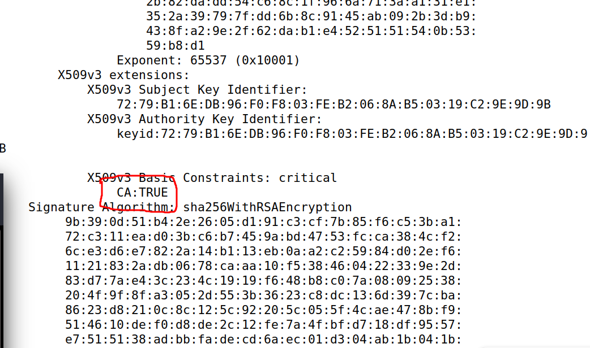
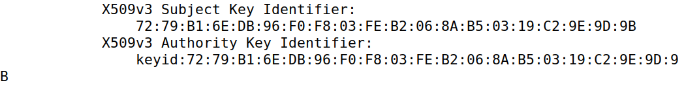

# Public-Key Infrastructure (PKI) Lab

## Task1

After running the commands:

```console
openssl x509 -in ca.crt -text -noout
openssl rsa -in ca.key -text -noout
```

• What part of the certificate indicates this is a CA’s certificate?


• What part of the certificate indicates this is a self-signed certificate?

  
• In the RSA algorithm, we have a public exponent e, a private exponent d, a modulus n, and two secret
numbers p and q, such that n = pq. Please identify the values for these elements in your certificate
and key files.
```
publicExponent: 65537 (0x10001)
```
```
privateExponent:
    00:a9:4f:f1:e1:a1:29:f8:e9:42:0c:97:07:4b:f9:
    a1:de:92:f2:53:3c:1c:69:c6:52:4d:04:9d:31:e6:
    9c:07:02:a9:71:14:62:f3:be:cb:c0:3e:43:86:fe:
    57:38:53:2b:37:ad:b7:d7:74:78:2a:17:9a:17:7b:
    ca:2f:66:c7:7d:92:27:4c:9c:2a:86:51:cb:1c:c5:
    45:1f:e3:b3:25:b5:c8:a2:69:8f:27:be:80:68:b3:
    fe:8a:17:69:ba:58:8c:5e:51:98:ea:f8:73:2b:ba:
    23:79:f9:45:64:d3:24:38:fd:55:ef:8d:20:8d:2a:
    6e:db:ba:22:0e:c0:78:fc:d5:e1:c2:c5:49:30:bb:
    95:69:13:44:96:5e:3c:92:00:ff:96:7f:73:c2:b8:
    16:40:80:ee:80:e9:1f:9c:64:64:3d:b4:bd:9b:2c:
    be:21:d9:85:6e:6a:a1:e2:83:92:a6:ab:b5:e8:83:
    df:77:fd:f7:10:40:ab:a2:86:db:fc:ba:a5:11:89:
    b2:4c:2d:23:2e:7c:02:0a:2d:88:48:ca:49:fb:c3:
    24:4e:c3:6b:06:5e:35:ea:8e:0a:a4:6b:7b:41:fc:
    b0:cf:6b:de:ce:be:e3:b0:6d:bf:e6:93:ed:ff:89:
    a4:21:d8:7e:24:a4:27:a4:7b:ad:b1:b7:97:c1:d7:
    31:d9:5b:c5:82:dd:64:59:dc:bb:37:21:d9:61:1e:
    72:4b:33:de:b1:09:a1:50:d1:6a:4f:6c:4c:a3:f7:
    2d:bf:c1:63:c4:c6:0c:ea:a1:ee:c3:50:13:4b:4a:
    29:1d:54:41:33:f2:7a:28:54:33:e4:d9:95:63:99:
    50:e5:73:09:a1:e7:72:c4:fe:ce:93:52:49:04:90:
    f2:8f:9f:16:f8:98:08:45:09:85:b4:1e:0a:26:18:
    59:52:fd:7e:af:f1:8b:16:95:88:d3:e7:11:b9:bd:
    c4:6b:d8:b2:1c:55:56:3f:26:53:9d:0b:46:a0:f1:
    22:69:a0:86:d0:50:c3:87:6f:bd:73:31:31:82:11:
    62:e6:34:3d:c5:3d:41:d3:51:9a:87:ee:56:1a:fe:
    9d:96:cf:36:07:4f:34:57:2f:11:ae:02:5a:e2:2e:
    20:e6:10:af:7e:aa:09:77:c0:39:8f:a2:e9:87:5c:
    c2:2e:ca:e7:e1:0b:bd:46:80:68:ac:e6:8c:3f:8a:
    0e:a0:a9:f7:56:28:f2:fc:5f:37:eb:41:45:41:99:
    1f:03:16:66:22:c8:06:13:63:a8:f8:5f:0b:ec:de:
    a3:10:18:4f:78:8a:f8:da:98:e0:01:02:2c:2f:4c:
    e2:52:06:8d:00:cc:ea:17:1a:30:bf:46:b9:03:4e:
    ea:8d:f9
```
```
modulus:
    00:ce:39:f7:32:2b:ec:24:23:08:20:2b:07:80:cc:
    89:dd:2d:31:b5:f1:0f:08:c2:06:5a:73:65:c3:53:
    c1:ae:1a:18:17:aa:26:59:48:c8:6e:f6:57:2b:64:
    0c:7a:6b:c0:d4:5b:28:66:4b:7e:d8:b5:6d:34:fb:
    90:6a:5a:08:2f:65:56:23:b3:42:f4:5d:25:6b:14:
    e5:5a:25:55:bb:bd:31:2f:fa:9a:41:52:cb:ea:be:
    71:66:0b:b8:f2:03:66:86:a3:13:6c:96:fc:5b:39:
    31:e4:24:45:4d:95:72:d3:80:ac:dd:a7:4b:a1:c5:
    62:33:d3:b8:fa:b1:5a:0d:90:5f:e2:0a:46:d8:1f:
    9f:09:da:18:f5:36:91:3a:b0:ca:26:00:42:16:4d:
    d2:e1:27:e4:fb:f9:1c:f6:a0:88:46:3a:f4:af:7a:
    e6:ac:0f:86:b1:a8:66:73:7d:34:03:88:33:54:1e:
    11:c6:4d:c6:cd:67:67:fe:2f:52:e8:76:14:36:4f:
    3e:e5:e0:76:47:27:80:84:fd:2a:a1:b8:b3:e9:b8:
    3b:b0:fb:08:24:f6:f8:92:68:69:5e:82:9c:4a:d4:
    b9:fe:67:94:41:cc:a5:61:09:c1:4f:f5:97:b4:ac:
    19:4a:4a:b2:ab:eb:c5:62:f3:3f:f6:20:fd:02:67:
    08:c1:2a:e5:78:43:9d:f3:7c:4b:30:b3:4f:12:4e:
    70:a7:ba:0b:07:80:9f:83:eb:de:7c:b7:c8:4a:5f:
    1f:22:c9:da:0a:a9:5a:36:2e:b7:aa:4c:e2:49:68:
    62:f6:0f:d1:74:1d:ed:b8:43:2a:9d:a3:7e:6e:21:
    f2:85:e2:5e:b8:8b:2d:e0:f2:06:44:9a:fb:02:c6:
    ac:59:5f:b5:37:f2:fb:35:86:30:8f:1e:de:fd:d0:
    9a:f1:2e:8a:4d:41:91:f6:89:cb:bd:fc:d7:ac:e7:
    7a:4b:df:39:35:19:95:a9:0e:c6:5d:3a:ff:22:8b:
    2d:2d:b2:2d:b5:c1:86:ca:b3:b9:98:d3:b4:08:c4:
    f6:da:08:42:cd:c1:0f:a3:6b:6b:58:a3:61:3b:a2:
    4e:73:e0:bf:ec:81:2a:a9:cf:4a:d7:1b:00:fb:98:
    ed:6c:66:34:38:b8:50:6a:f8:1c:b3:c8:cd:5e:18:
    e3:dc:15:48:d0:c3:1a:7b:e6:24:e2:6c:ef:aa:2b:
    03:1b:c3:5f:55:f4:0d:06:dd:b0:74:a7:c0:50:9a:
    2b:82:da:dd:54:c6:8c:1f:96:6a:71:3a:a1:31:e1:
    35:2a:39:79:7f:dd:6b:8c:91:45:ab:09:2b:3d:b9:
    43:8f:a2:9e:2f:62:da:b1:e4:52:51:51:54:0b:53:
    59:b8:d1
```
Secret Number p:
```
prime1:
    00:f7:06:94:c2:57:31:5f:7c:60:ce:bb:03:dc:b6:
    70:fc:de:bd:1e:bb:b5:8f:d2:33:e3:5a:eb:23:c7:
    5e:51:1d:b5:f4:e8:39:ba:af:af:85:b4:95:f6:e4:
    30:6a:de:e3:00:4e:78:a0:15:39:57:0c:b5:1b:d6:
    92:dd:62:5e:1e:73:34:87:62:6d:a6:51:99:00:2c:
    0d:b1:cc:7a:92:9a:23:72:e0:ae:c2:64:e7:d5:96:
    0b:ce:78:ee:00:f0:3c:04:4a:3f:e5:d2:74:47:cf:
    0a:f5:e9:0a:18:40:9f:6d:cc:93:8f:6f:8c:8c:c2:
    8b:b9:5b:db:42:18:33:2b:89:56:7a:5c:06:26:a1:
    d4:a9:7f:89:a1:e7:84:5d:72:a9:bd:c6:2d:25:bb:
    0c:d8:dc:83:f8:11:ae:c3:5a:33:58:1c:bf:71:ef:
    ab:3c:3a:bb:b6:73:6a:3a:91:ad:ba:69:74:85:61:
    e6:5e:44:9c:0d:e4:43:95:fa:ca:10:91:09:f0:5d:
    0d:17:0f:a1:f9:16:89:48:c8:ef:7a:57:19:56:ff:
    f3:b8:65:0d:4d:2b:2d:13:84:96:dc:8b:16:be:ed:
    95:e4:e4:17:68:9b:36:6f:8e:45:7e:a1:c8:d9:76:
    45:c1:da:fb:40:9f:90:9d:2a:98:b8:fa:55:8a:c6:
    6c:47
```
Secret Number q:
```
prime2:
    00:d5:b7:f0:23:32:df:c2:19:71:b1:35:d8:c1:f7:
    5f:68:7b:ec:40:7a:8a:a9:60:5e:d6:2d:85:46:bc:
    05:24:ea:17:48:37:2d:13:03:26:34:1c:69:fc:27:
    d4:6f:46:d1:4f:57:47:1a:e9:ce:16:36:9b:15:8f:
    6d:83:d5:7f:0b:9e:5c:be:6f:df:be:7c:ca:48:90:
    c1:48:fe:1f:7a:6d:d1:06:fe:c6:ad:ff:11:11:6e:
    68:ab:25:e3:f9:d4:8d:19:aa:e5:db:d8:1f:61:8c:
    c6:d6:ce:2d:d7:ef:af:15:a2:59:ee:d6:94:ce:34:
    26:e1:e0:18:2e:2b:3f:a3:a5:81:bd:43:b5:12:30:
    b6:0d:39:1e:bf:b0:c3:78:0f:f3:82:9f:a0:96:35:
    4e:05:13:c3:b5:73:a7:52:33:17:8c:3a:b3:87:f3:
    64:1c:bb:18:e0:4a:98:89:29:9f:37:d8:31:4b:5f:
    1d:97:03:15:51:46:d7:bb:09:ef:7c:36:8e:14:cd:
    d6:c1:96:9f:6a:65:37:d4:b2:2e:c2:8c:30:fa:f1:
    7e:57:a0:c8:22:7c:b0:32:a8:f8:bb:60:65:2c:31:
    fc:21:5a:74:54:6a:74:49:c3:d5:8c:9b:0d:b3:45:
    38:40:35:93:56:9e:b8:8c:13:ee:57:95:de:34:d5:
    f6:27
```


## Task2

## Task3

## Task4

## Task5

## Task6

