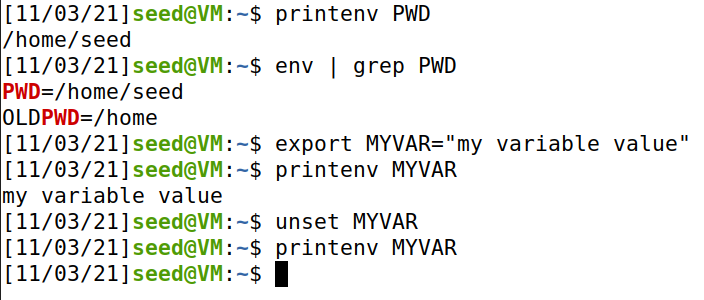
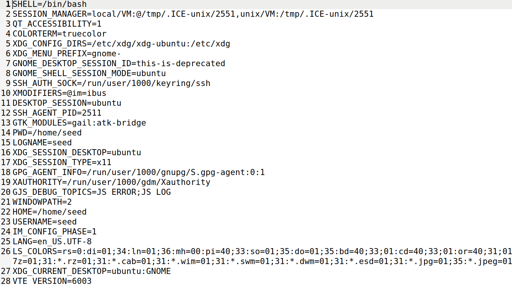
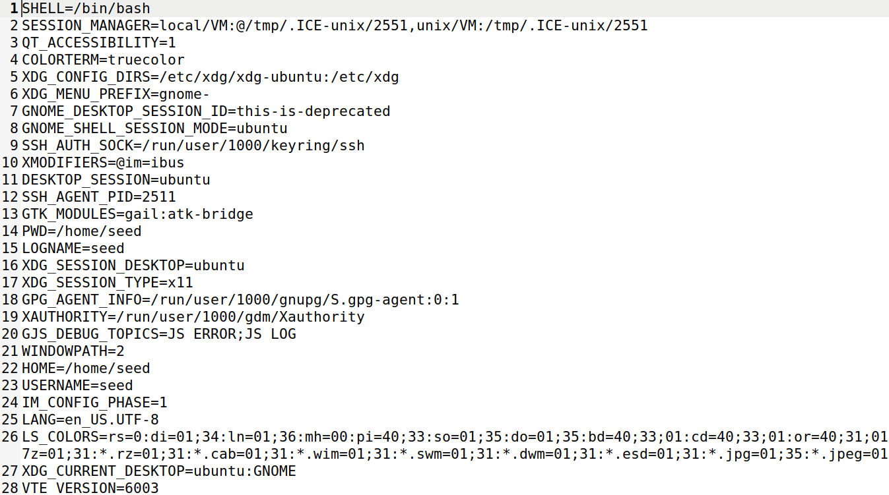
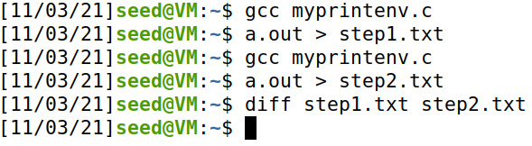
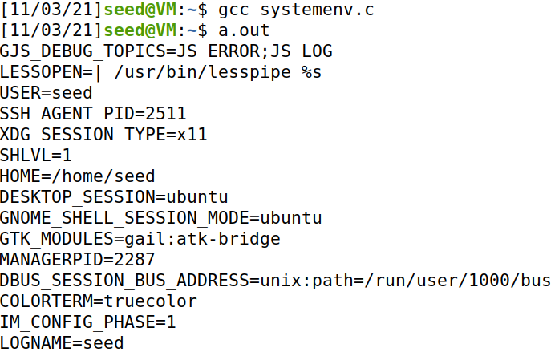

# Environment Variable and Set-UID Program Lab

## Task 1:

## Task 2:

**Step 1** - The program printed all the environment variables of the child process and their respective values.

**Step 2** - The program printed all the environment variables of the parent process and their respective values.

**Step 3** - The *diff* command accused no difference between both files, so we conclude that all the parent's environment variables are inherited by the child process.

## Task 3:

**Step 1** - The program doesn't print anything, which means that the new program has no environment variables declared.

**Step 2** - The program now prints all the environment variables of the first program.

**Step 3** -  The new program gets its environment variables through the third parameter of the *execve* function, which is a string of environment variables. The variable *environ* points to an array of pointers to strings, which is made available to the process by the *execve* call when a new program is started.

## Task 4:

## Task 5:

Both environment variables PATH and ANY_NAME get into the Set-UID child process. However, the variable LD_LIBRARY_PATH doesn't belong to the Set-UID child environment variables.