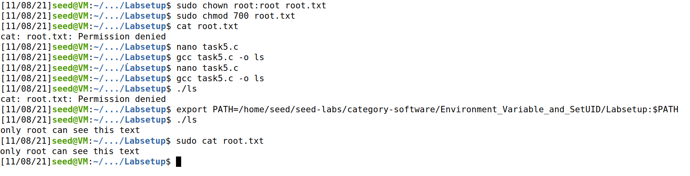
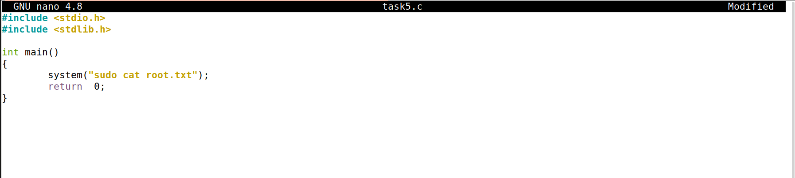

# Environment Variable and Set-UID Program Lab

## Task 1:


## Task 2:

**Step 1** - The program printed all the environment variables of the child process and their respective values.


**Step 2** - The program printed all the environment variables of the parent process and their respective values.


**Step 3** - The *diff* command accused no difference between both files, so we conclude that all the parent's environment variables are inherited by the child process.


## Task 3:

**Step 1** - The program doesn't print anything, which means that the new program has no environment variables declared.

**Step 2** - The program now prints all the environment variables of the first program.

**Step 3** -  The new program gets its environment variables through the third parameter of the *execve* function, which is a string of environment variables. The variable *environ* points to an array of pointers to strings, which is made available to the process by the *execve* call when a new program is started.

## Task 4:


## Task 5:

Both environment variables PATH and ANY_NAME get into the Set-UID child process. However, the variable LD_LIBRARY_PATH doesn't belong to the Set-UID child environment variables.

## Task 6:

As the Set-UID program does not execute /bin/ls but rather executes the ls command, it is possible to change the path so that executing ls executes a local executable file name ls rather than /bin/ls.
Below there is a picture showing how we created a file that only root could read and how we read with a non-root user.
The second picture shows the contents of the C file used to create the ls executable




## Task 7:

- Running *myprog* as a regular program and as a normal user, the sleep function is overridden from *mylib.c*, so the message is printed.
- Running *myprog* as a Set-UID root program and as a normal user, the default sleep function is executed, because the Set-UID imposes the functions from the libraries associated to the file owner, which is the root.
- Running *myprog* as a Set-UID root program and as a root user, the sleep function is overridden from *mylib.c*, so the message is printed. This happens because we exported the LD_PRELOAD variable as the root, and the Set-UID forces the libraries of the file owner.
- Running *myprog* as a Set-UID user1 program, exporting the variable as user1, and running the program as user2, the default sleep function is executed, since the Set-UID imposes the file owner (user1) libraries.

## Task 8:

**Step 1** - Yes, it is possible by concatenating commands in order to activate bash, using "**;**". For example, if Bob wants to consult *file*, and to remove the file *important*, he can just use:

```bash
catall "file; /bin/sh"
$ rm important
```

Bash will be activated no matter the first command runs successfully or not.

**Step 2** - No, the previous attack doesn't work, since it displays:

```bash
/bin/cat: 'file; /bin/sh': No such file or directory
```

This happens because the *execve* function treats the string as an argument of the *cat* command instead of invoking bash like the *system* function does.

## Task 9:

It is possible to write to the **/etc/zzz** file by adding the following line to the end of the program, after the *open* function:

```c
write(fd, "Malicious Data\n", 15);
```

This happens because the file is opened before the UID is set, so it's opened with root privileges, which include writing to the **zzz** file. Moving the setuid(getuid()) line to the section before opening the file avoids this problem.

# Capture The Flag

- Gather information from navigating in the website and discovered the versions of Wordpress and its plugins in [this page](http://ctf-fsi.fe.up.pt:5001/product/wordpress-hosting/) in the "informação adicional" tab
- Proceeded to search known vulnerabilities present in Wordpress and Plugins versions discovered. Using the tool searchsploit we found a vulnerability in Booster for WooCommerce plugin, whose identifier is CVE-2021-34646, that allowed us to authenticate as a specific user without permission
- Submit 1st flag ("**flag{CVE-2021-34646}**")
- Search for an exploit to be applied to this vulnerability, using the tool searchsploit we managed to use the exploit whose path is /usr/share/exploit-db/exploits/php/webapps/50299.py
- Using the link https://ctf.fe.up.pt:5001/wp-json/wp/v2/users/ we saw that the admin account had ID = 1, to be used in the exploit execution.
- The exploit prints 3 links, and clicking on the first one we're redirected to the shop page already logged in as an admin.
- Using the link suggested in Moodle, and entering the admin private chat, we're gifted with the flag "**flag{13113486ec6a575c848b95ea324d901d}**"