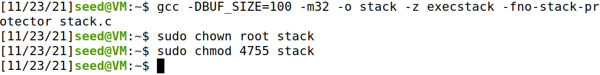

# Buffer Overflow Attack Lab (Set-UID Version)

## Task 1

Both of the programs seem to work the same, no output errors and both successfully run shell command

## Task 2

## Task 3

- Created *badfile*, compiled using make and used gdb to debug the file stack-L1-dbg
- Created a breakpoint in the function *bof*
- Write *run* to start executing the program, followed by *next* to execute a few instructions and stop after the **ebp** register is modified to point to the stack.
- Check **ebp** value using `p $ebp`: 0xffffc978
- Check the variable **buffer** value using `p &buffer`: 0xffffc90c
- Run `x/100 0xffffc90c` to get the address
- Insert the values in the `exploit.py` script
- We gave `start` the value 200, a value big enough to fill the code with NOPs to reach the return address
- We gave `ret` the address 0xffffc9cc, a value selected some registers after the return address to have room to execute the shell code
- We gave `offset` the value 112 because its the register difference between the buffer and the str pointer, (100 + 8 + 4)
