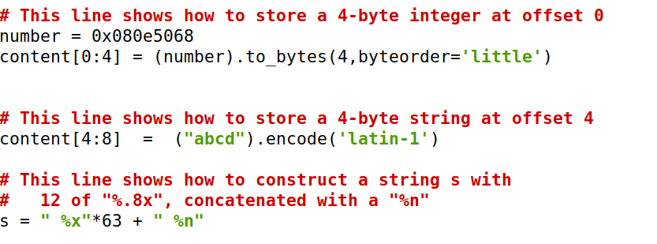

# Format String Attack Lab

## Task 1

- Started by running the docker commands, to initiate the containers
- Access shell by running docksh with the initial digits of the container: `docksh 93`
- Run the command `echo hello | nc 10.9.0.5 9090` and see the prints in the shell where the container is running, including the smiley faces.
- Run the `build_string.py` script, which will generate 1500 bytes and write them to the file `badfile`
- Run the command `cat badfile | nc 10.9.0.5 9090` and notice that the smiley faces don't apear in the shell running the containers, which means that the server crashed. This happened because the string written to the `badfile` contained the bytes `%.8x` (could be `%s` instead, for example), which makes the program look for an address that doesn't exist.

## Task 2

#### Task 2.A

- Run the command `echo hello | nc 10.9.0.5 9090` to see the printed information about some addresses.
- Run the command `echo abcd %x %x %x %x %x %x | nc 10.9.0.5 9090` and noticed that the address of the input buffer is printed at the end
- Run the command `echo abcd %x %x %x %x %x %s| nc 10.9.0.5 9090` to print the first 4 bytes of our input
- Therefore, we need 5 `%x` format specifiers to get the server to print out the first four bytes of our input (in this case it prints **abcd**)

#### Task 2.B

- Run the command `echo hello | nc 10.9.0.5 9090` to see the printed information about the secret message address, which is 0x080b4008.
- In the python script, enter that address in the first positions of the `content` variable and print many `%x` to find out the position of the secret message address.
- After finding it out, place a `%s` in the spot of the secret message address.
- After the values of the `%x`, the message "A secret message" is printed to the screen.

## Task 3

#### Task 3.A

- Run the command `echo hello | nc 10.9.0.5 9090` to see the printed information about the target variable address, which is 0x080e5068.
- In the python script, enter that address in the first positions of the `content` variable and print many `%x` to find out the position of the target variable address.
- We found out that the address was printed as the *64th* `%x` 
- Therefore, we placed a `%n` in the place of the *64th* `%n` (the target variable address), to change its value to the number of bytes written before.
- In the prints, we can see that the value of the target variable has changed.

#### Task 3.B

- The target variable address is 0x080e5068, printed as the *64th* address.
- Then, we converted the 0x5000 hexadecimal value, which is the desired value for the target variable, into decimal, and found out that it's equivalent to 20480.
- Now we know that we need to write 20480 bytes before applying the `%n` to the address of the target variable.
- After this, we wrote many `%.8x` till we found the correct number of bytes that we needed to print before the target variable address. The string is shown in the following figures.

