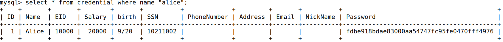
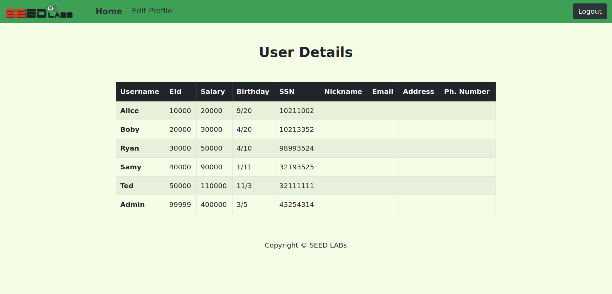
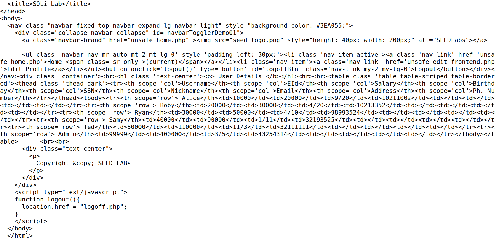
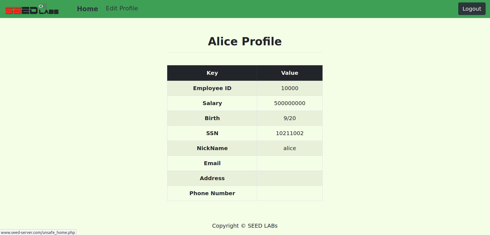
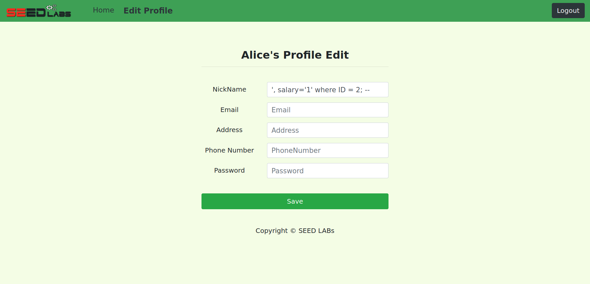

# SQL Injection Attack Lab

## Task 1

- Using the command `SHOW TABLES;` we were able to see that the only table of the database is called `credentials`.
- Then, we created a query to retrieve the information about the user called Alice, shown in the following print:

## Task 2

#### Task 2.1

- Knowing that the username of the administrator account is *admin*, we could ignore the password verification by ending the query with an *;* and commenting the rest of the line, using the symbol *#*. This way, we could use the field of the username input to do that, by entering the string `admin'; #`.
- Then, we successfully logged in as an administrator, and we can see the information of all the employees.

#### Task 2.2

- To send an HTTP GET request in order to login as an administrator, we must first prepare its url.
- We did it in a way that the input of the username field is the same of the previous task and that the special characters are properly encoded. In this case, we needed to replace the *'* character by *%27* and the space characters by *%20*.
- The final command to run is `curl 'www.seed-server.com/unsafe_home.php?username=admin%27;%20--%20'`

#### Task 2.3

- The **PHP** instruction *query()* only allows execution of one *SQL* statement. In order to run multiple queries, the function *multi_query()* must be used.

## Task 3

#### Task 3.1

- Login as the Alice user, entering the string `alice; -- ` in the username field.
- Go to the Edit Profile page and enter the string `alice', salary='x` in the nickname field, where x is the value to update the salary.
- For example, by inserting 500000000 in the place of x we manage to update Alice's salary to 500000000.

#### Task 3.2

- The first step is to enter the system as an admin to find Boby's id. This can be done by entering the string `admin'; -- ` in the username field. Boby has id with a value of 2.
- Now, login as Alice and enter the Edit Profile page, then insert the string `', salary='1' where ID = 2; -- ` in the nickname field.
- As it can be seen, we successfully altered Boby's salary to 1.

# Capture The Flag

## Challenge 1:

- Downloaded the files provided for this CTF.
- Analyzed the PHP file and noticed that the username and password checks are done sequentially and there is no treatment of the input, in the line 40.
- Enter the string `admin'; -- ` in the username field, and type anything into the password field.
- Press login and then the vault is successfully unlocked, and the flag is shown.
- Submit 1st flag ("**flag{f22ac97119fe5eb115390b801dec81dd}**")

## Challenge 2:

- A non-authenticated user is able to:
    - login
    - execute the *ping* command, which is a shell command
    - make a speed report
- The *ping* command is a Linux utilitary.
- This call is vulnerable since an attacker can gain access to the shell.
- Entering the string `; cd /; find -name 'flag.txt' | cat flag.txt` in the Ping Host field, we manage to see
the contents of the flag.txt file on the server.
- Submit 2nd flag ("**flag{d06fce540d52821ea7f32acdfaf603ff}**")